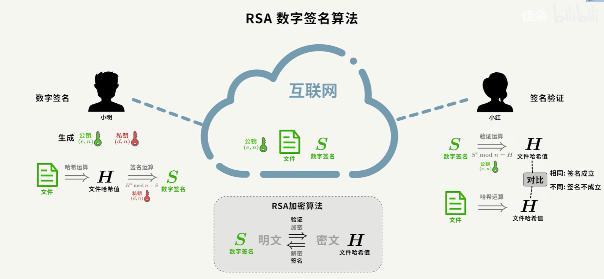
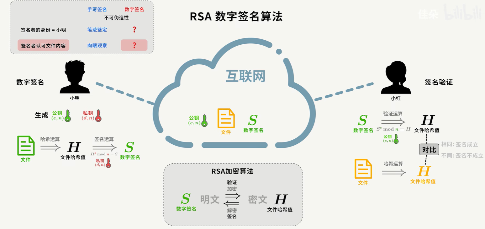
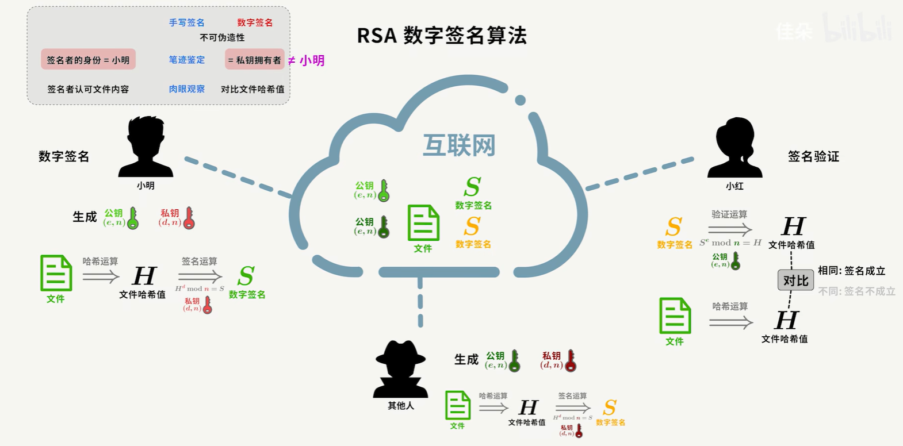
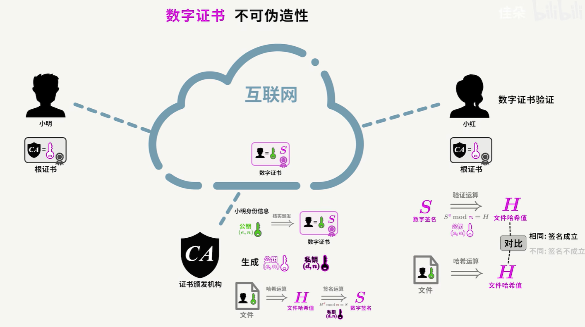
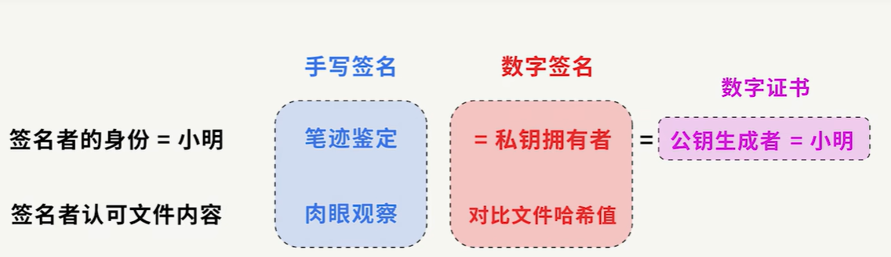

## 基本概念
数字签名是一种用于验证信息完整性和身份认证的技术。它类似于手写签名，但用于电子文档。数字签名确保数据在传输过程中没有被篡改，并且可以确认发送者的身份。

常见数字签名算法：RSA，DSA，ECDSA

RSA：RSA加密算法 + 哈希算法

加密解密算法:对称加密（单密钥加密），非对称加密（公开密钥加密）

哈希算法（散列函数）：只能单向加密，不能解密，生成一个唯一的固定长度的哈希值（散列码），eg：MD5.

## 工作原理

1. 生成密钥对
公钥和私钥 ：数字签名基于公钥密码学，用户首先生成一对密钥：公钥和私钥。私钥应保密，而公钥可以公开。
2. 创建签名
哈希计算 ：发送者对要发送的数据（消息）使用哈希函数生成一个固定长度的**哈希值**（摘要）。
加密哈希 ：发送者用自己的私钥对这个哈希值进行加密，生成**数字签名**。
发送数据 ：发送者将原始数据【文件】、数字签名一起发送给接收者。
> 问题：接收方是如何拿到公钥的
> 接收方获取公钥的时机和方式取决于具体的应用场景和使用的协议。以下是一些常见的情形：
> 
> 1. 直接传输
> 在某些情况下，发送方会直接将其公钥与消息一起发送给接收方。这种方法简单，但存在中间人攻击的风险。
> 
>2. 使用CA证书
>在使用数字证书的情况下，公钥通常包含在由CA（证书授权机构）签发的证书中。接收方可以通过以下步骤获取公钥：
>
>+ **接收者获取证书** ：发送者会将其CA证书发送给接收者，或在某些情况下，接收者可以从公钥基础设施>（PKI）中获取证书。
>+ **验证证书** ：接收者使用CA的公钥验证证书的有效性。
>+ **提取公钥** ：一旦证书被验证，接收者可以从证书中提取发送者的公钥。
>3. 预先共享
>在某些情况下，发送方和接收方可能在通信之前已经通过安全的渠道共享了公钥。例如，在初始设置时，双方可以通过面对面的方式、电话或其他安全渠道交换公钥。
>
>4. 公钥基础设施 (PKI)
>在一些大型系统中，公钥可能存储在一个公钥基础设施（PKI）中，接收者可以通过查询该基础设施来获取公钥。这种方式通常用于企业或组织内部的安全通信。
>
>5. 密钥交换协议
>在某些加密协议中，如Diffie-Hellman密钥交换，公钥是在协商过程中动态生成和交换的。
>
>总结
>接收方获取公钥的时机和方式多种多样，通常取决于所使用的协议和系统的设计。通过CA证书是最常见和安全的方式之一，因为它确保了公钥的真实性和完整性。

3. 验证签名
接收数据 ：接收者收到原始数据【文件】和数字签名。
重新计算哈希 ：接收者对接收到的原始数据【文件】使用相同的哈希函数计算出哈希值。
解密签名 ：接收者用发送者的公钥解密数字签名，得到发送者的哈希值。
比较哈希值 ：接收者将自己计算的哈希值与解密得到的哈希值进行比较。如果两者相同，数据未被篡改，且发送者的身份得到了确认。
> 问题：接收方是如何知道这个哈希函数的？
> 接收者知道使用哪个哈希函数是因为在签名过程中，发送者和接收者之间通常会有一个约定或标准。以> 下是一些常见的情况，说明接收者如何知道使用的哈希函数：
> 
> 1. 协议规范
> 在许多通信协议中（例如TLS/SSL、电子邮件协议等），会明确规定使用的哈希函数。例如，某些协议可能规定使用SHA-256作为哈希函数。在这种情况下，所有参与者都知道并遵循这一标准。
> 
> 2. 证书中的信息
> 在使用CA证书时，证书本身通常会包含有关使用的哈希算法的信息。接收者可以从证书中读取这些信息，以确定在验证签名时应使用哪个哈希函数。
> 
> 3. 应用程序和库
> 许多应用程序和加密库（如OpenSSL、Bouncy Castle等）会在实现中指定使用的哈希函数。开发者通常会在代码中明确选择哈希算法，接收者只需遵循这些实现即可。
> 
> 4. 文档和协议说明
> 在某些情况下，发送者和接收者可能会通过文档或协议说明进行沟通，明确约定使用的哈希函数。
> 
> 5. 默认哈希函数
> 有些系统或应用程序可能会有默认的哈希函数。如果双方都使用相同的系统，接收者可以假设使用的是默认的哈希函数。
> 
> 总结
> 接收者通常通过协议规范、证书信息、应用程序实现或双方的约定来确定使用的哈希函数。这种约定确保了数据的完整性和有效性。

## 问题环节

**问题1**：互联网世界中怎么样确定接收到的数据【文件】是否被修改过呢？

因为若是文件被篡改，那么接收方收到的文件哈希运算的文件哈希值就和数字签名得到的哈希值不一致，签名验证不通过。从而获悉文件被篡改了。

**问题2**：如何确保数字签名来源于发送方？

很好理解，数字签名来源于私钥拥有者，但是私钥拥有者不一定是发送方小明，因为存在中间人攻击可能。
中间人使用自己私钥进行签名得到数字签名，将公钥、数字签名、文件发送给接收方小红，小红拿到中间人的公钥对数字签名进行验证运算得到文件哈希值，和文件进行的哈希运算得到的哈希值是一致的，那么接收方无法确认文件是否被篡改。

由于私钥和公钥是一对，只需要证明接收方小红收到的公钥是发送方小明的即可。请问问题3。

**问题3**：如何验证公钥是否来自发送方？
此时需要进行身份验证，来证明数字签名来源于发送方小明，这就是数字证书的作用。

发送方将个人信息和公钥发给CA机构（数字证书认证机构），CA机构会生成一个数字证书，包含了发送方身份信息及公钥，即证明公钥生成者就是接收方小明。
小明将证书放到互联网上，接收方小红拿到证书，就可以确认公钥是否属于发送方小明了。

那么，另外一个问题来了，这个数字证书被伪造了，怎么办呢？请看问题4.

**问题4**：怎么防止数字证书被伪造呢？

因为数字证书是经过CA机构数字签名的，CA机构自己也生成一对公钥私钥，对**发送方小明身份信息及公钥这一文件内容**用私钥进行签名运算，将生成的数字签名S2放入数字证书中，CA机构的信息及公钥已经提前植入在操作系统或浏览器中，称为根证书，记录了可以信赖的CA机构信息及其公钥。接收方收到数字证书后，用CA的公钥解密数字证书里的数字签名S2，得到发送方公钥和身份信息的哈希值。
即接收方收到的数字证书中包含了数字签名S2，这个数字签名S2使用浏览器内置的CA机构公钥解密，可以得到文件哈希值，和文件【包含发送方小明身份信息及公钥】进行的哈希运算得到的哈希值是一致的，那么接收方就可以确认数字证书的真实性，没有被伪造。

综上，可以得出
签名验证【哈希值对比】保证 文件的完整性
数字签名+数字证书 保证 文件的真实性
