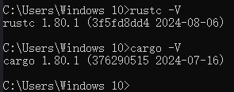

## 环境搭建
[Windows离线安装Rust](https://blog.csdn.net/qq_27071221/article/details/129247549)
在线安装
执行官网 RUST-init.exe

安装：


## 安装问题
Rust报错：the msvc targets depend on the msvc linker but `link.exe` was not found
```shell
rustup uninstall toolchain stable-x86_64-pc-windows-msvc
rustup toolchain install stable-x86_64-pc-windows-gnu
rustup default stable-x86_64-pc-windows-gnu
```