## 4R架构– Rank + Role+ Relation+ Rule
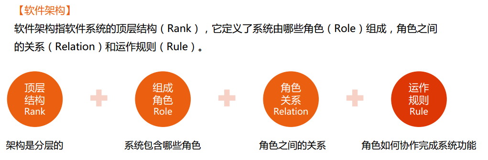
汽车的案例
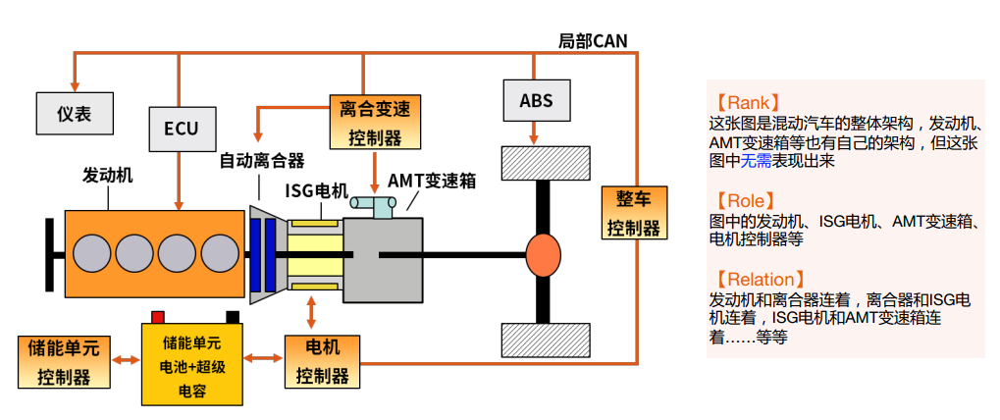
## 架构分层案例：L0~L2
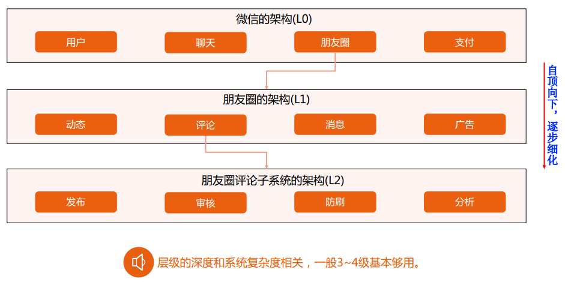
## 4+1视图的定义
1995 年，Philippe Kruchten在《IEEE Software 》上发表了题为《The 4+1 View Model of Architecture 》的论文，引起了业界的极大关注，并最终被RUP采纳。
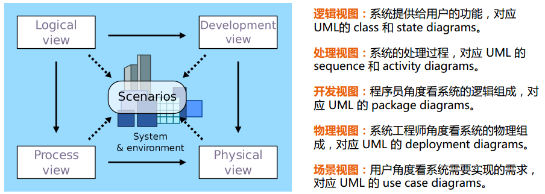
**4+1 架构视图– 现状**：
1. 架构复杂度增加：1995 年的系统大部分还是单体系统，现在分布式系统。
2. 绑定UML图：UML图画架构图存在问题。
3. 理解困难：4+1 视图的逻辑视图、开发视图、处理视图比较容易混淆。

目前国内企业较少使用4+1视图，面向日韩的外包使用较多，因为4+1视图1995年提出，并且现在系统架构更为复杂，4+1视图已经不满足需求。

UML画架构图的核心问题:
颜值即正义：UML架构图主要是太丑
## 架构图分类和总体思路
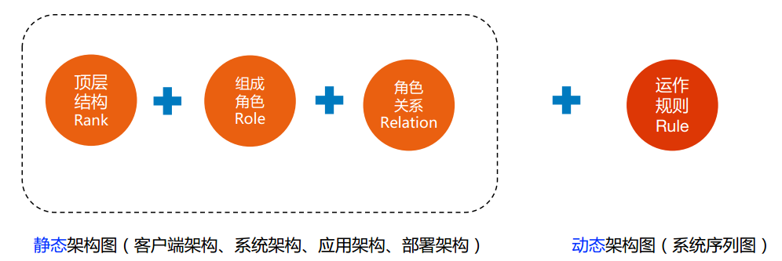
## 静态架构图
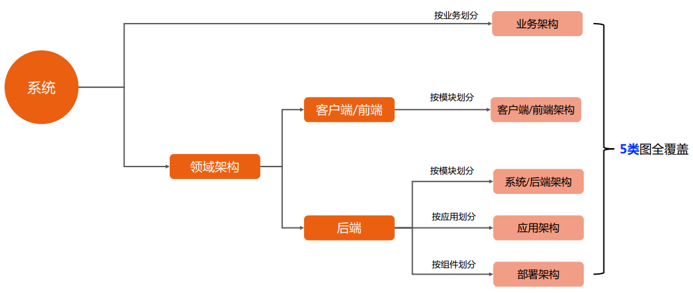
前端架构复杂性相对后端简单。
业务架构图、前端架构、后端架构、应用架构、部署架构
## 业务架构图
这里使用ppt画的
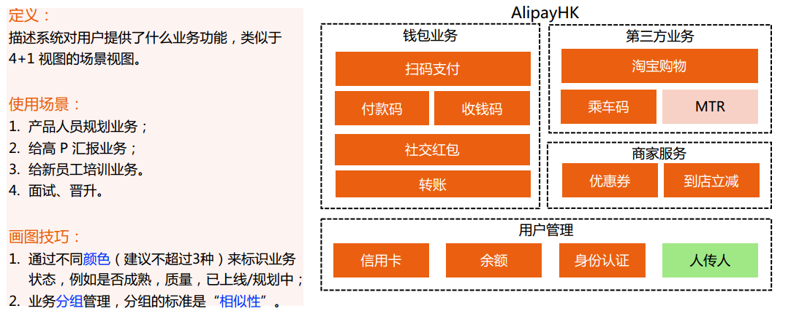
长短意义：只是为了对齐好看
分组意义：管理域，意味着由1个P8来管理，而不是由多个P8来管理
## 客户端/前端架构（钱包案例）
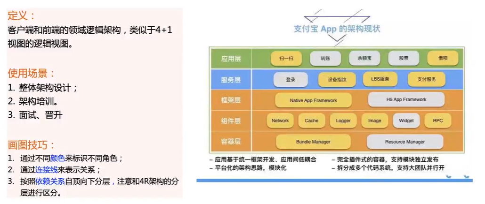
## 系统架构-简单
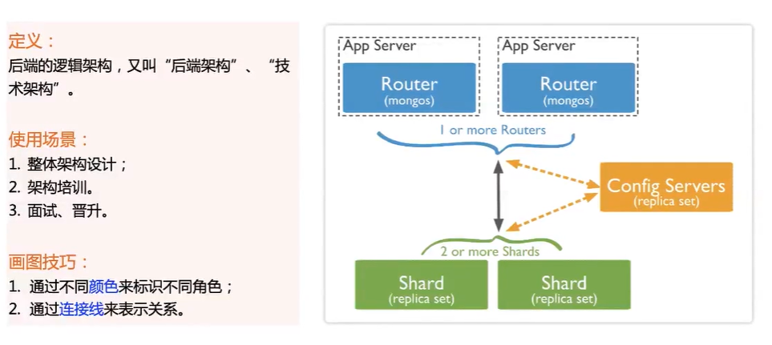

## 系统架构-复杂（钱包案例）
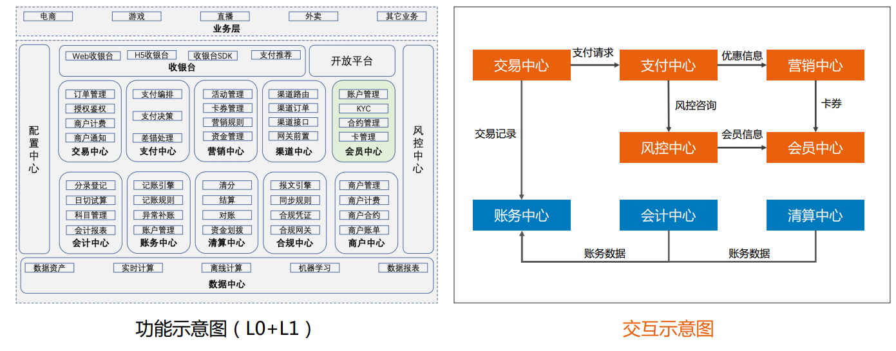

## 应用架构（钱包案例）
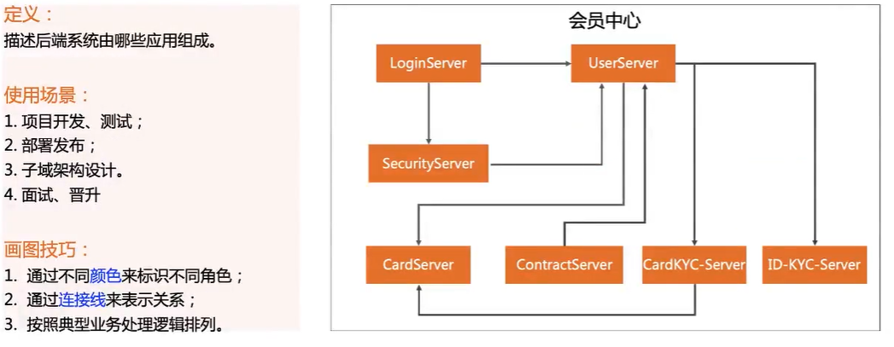
## 应用架构（开源案例）
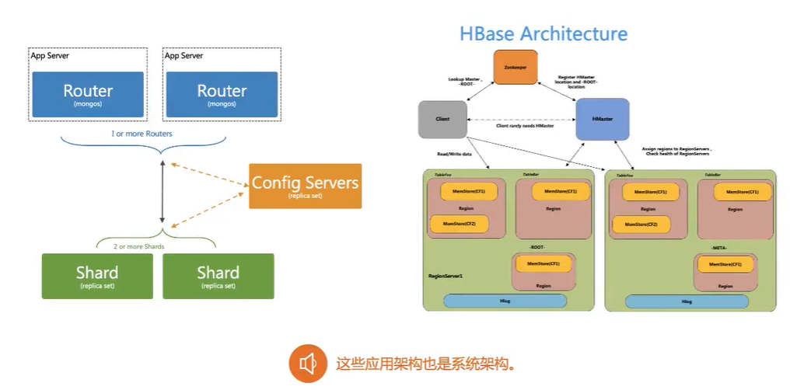

## 部署架构（钱包案例）
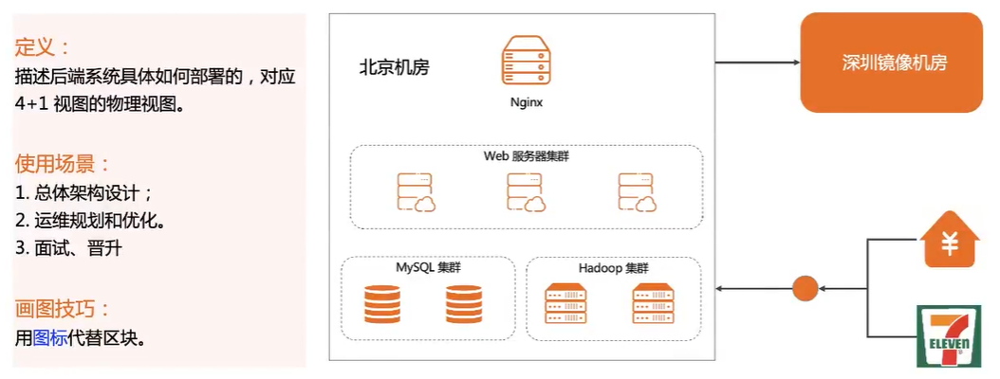
¥图标代表银行，7天图标代表便利店
## 系统序列图
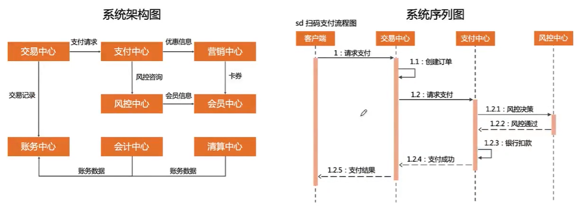
关键：要有核心的业务场景
可以用UML画