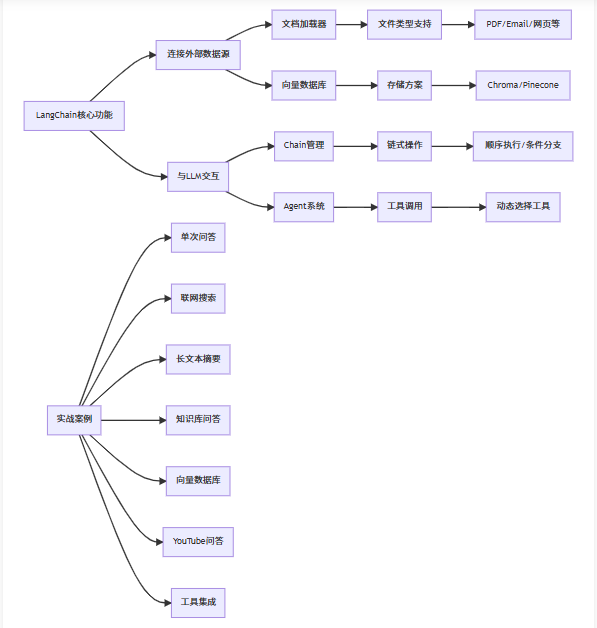

# 简介
LangChain 0.3.27



# 实战案例

## 单次问答

```python
# 先安装新版本依赖
# pip install -U langchain-openai

from langchain_openai import ChatOpenAI

# 初始化 ChatOpenAI 模型
llm = ChatOpenAI(
    model="deepseek-chat",               # 或 deepseek-coder
    openai_api_key="sk-xxxx",
    base_url="https://api.deepseek.com/v1",
    temperature=0.7
)

# 调用模型并获取回答
response = llm.invoke("怎么评价人工智能")
print(response.content)
```

## Pydantic 类

希望模型返回一个 Pydantic 对象，我们只需传入所需的 Pydantic 类。使用 Pydantic 的主要优点是模型生成的输出将会被验证。如果缺少任何必需字段或字段类型错误，Pydantic 将引发错误。

```python
from typing import Optional
from langchain_openai import ChatOpenAI
from pydantic import BaseModel, Field

# 初始化 OpenAI 模型
key = 'sk-0efkBLDZ4YnGjwDfV037CtKIleQmGfAE21hpfOhJd5vfZm1k'
llm = ChatOpenAI(
    model_name="GLM-4.1V-Thinking-Flash",
    base_url="https://www.dmxapi.cn/v1",
    api_key=key,
    temperature=0.7
)

# 定义 Pydantic 模型
class Joke(BaseModel):
    """用来给用户讲的笑话"""
    setup: str = Field(description="笑话的铺垫")
    punchline: str = Field(description="笑话的笑点")
    rating: Optional[int] = Field(
        default=None, description="笑话的有趣程度，1-10分"
    )

# 使用结构化输出生成笑话
structured_llm = llm.with_structured_output(Joke)
prompt = "给我讲一个关于猫的笑话，请按照以下 JSON 格式返回：{\"setup\": \"...\", \"punchline\": \"...\", \"rating\": ...}"
response = structured_llm.invoke(prompt)

# 也可以直接调用
# response = structured_llm.invoke("给我讲一个关于猫的笑话")
print(response)
```

### 输出结果示例：
```
setup='Why did the cat sit on the keyboard?' 
punchline='Because it wanted to compose a meow-sic album. Now I can't type!' 
rating=8
```

## 参考文档
- [LangChain 教程](https://blog.csdn.net/qq_56591814/article/details/131376763)
