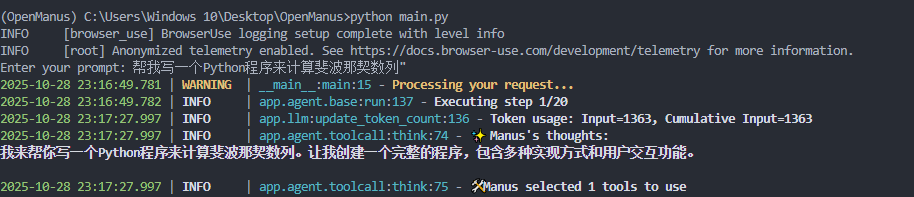

## 运行OpenManus项目的步骤

### 创建并激活新的conda环境
```bash
conda create -n open_manus python=3.12
conda activate open_manus
```

### 安装项目依赖
```bash
pip install -r requirements.txt
```
或者使用uv（如果已选择uv方法）：
```bash
uv pip install -r requirements.txt
```

### 配置API密钥
复制配置文件模板：
```bash
cp config/config.example.toml config/config.toml
```
在其中加入你的API密钥
### 运行项目

稳定版本（推荐）：
```bash
python main.py
```
程序已启动并显示 "Enter your prompt:" 提示

