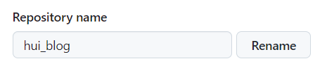

## github部署脚本
参见：[github部署脚本](https://github.com/guohui1992/hui_blog/tree/master/.github/workflows/deploy.yml)

## github settings
参见：[github settings](https://github.com/guohui1992/hui_blog/settings)
指定仓库名称



## github pages
若有自己的域名，可以替换github生成的域名`guohui1992.github.io`
比如：域名是 `www.guohuidev.top`
填写到 Custom domain中，点击 Save

## 域名解析配置
登录到域名注册商网站，检查 DNS 记录是否正确：
对于根域名（guohuidev.top），需要添加 A 记录，指向以下 GitHub Pages 的 IP 地址：
185.199.108.153
185.199.109.153
185.199.110.153
185.199.111.153
对于子域名（如 www.guohuidev.top），需要添加 CNAME 记录，值为 guohui1992.github.io。

## 域名解析验证
[whatsmydns.net](https://www.whatsmydns.net/#CNAME/www.guohuidev.top)

## 注意事项
+ 博客代码的css相关文件base地址必须是/，否则css文件会404， 构建的dist文件index.html
```html
<link rel="modulepreload" href="/assets/app.c198ef4d.js">
```